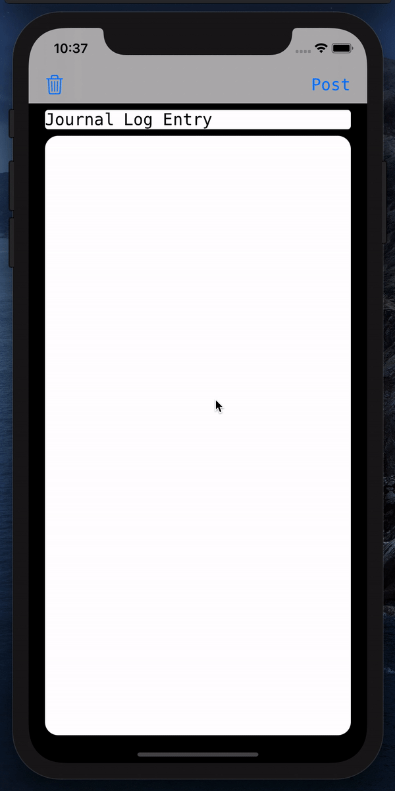

# 📝 ComposerViewController



> TL;DR Present a User Text Input View Controller 

This project was inspired by a few hackathon designs I've seen this year while mentoring for [Cal Hacks](https://calhacks.io/).  The modal text input design pattern is used to allow users to post/save text.

## Interactions
* **Post Text** - *Save* ✅
* **Discard Text** - *Trash* 🗑

## Getting Started

1. ✅  Fork the Project
2. ✅  Build + Run 
3. ✅  Tap to Present the View Controller
4. ✅. Start Composing 🖋

## Try it Yourself

Update any of these `FirstViewController`, `SecondViewController`, or `ThirdViewController` and add more than just a different background color.

```swift

class ViewController: UIViewController, ComposerViewControllerDelegate {

    ... 

    // MARK: ComposerViewControllerDelegate

    func composerViewControllerDidPost(viewController: ComposerViewController, model: ComposerModel) {
      // User Tapped "Post" Button.  Save the model.
    }
    
    func composerViewControllerWillDiscardPost(viewController: ComposerViewController, discardHandlerShouldDiscard: @escaping (Bool) -> ()) {
      // User wants to discard post, prompt an alert if necessary
    }
}


```

## Help Improve This Project! Make a PR

* **Add Documentation** - for publc classes/methods.  See [Swift Documentation](https://nshipster.com/swift-documentation/)
* **Create an App** - show me what you can make with my starter project!

## Need iOS Help?

* Open an issue above ^ and I'll give you feedback to get you unstuck 👍

## Prerequisites

* Xcode 12.0+

## Authors

* **Alex Takahashi** - *Initial work* - [alextakahashi](https://github.com/alextakahashi)

## Acknowledgments

* [README-Template](https://gist.github.com/PurpleBooth/109311bb0361f32d87a2)

## Liability
I am not a lawyer, but **no guarantees if this breaks, totally not responsible if things go to shit - don't sue me**, kthx.  Add *MIT License*.
